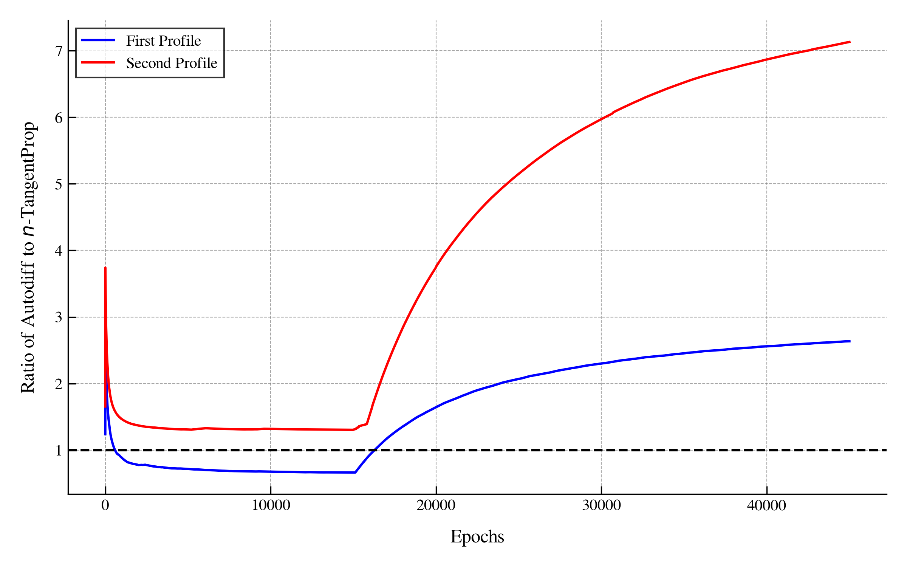

# $n$-TangentProp
$n$-TangentProp (NTP) is a method for computing $\frac{d^n}{dx^n}u(x)$ of a neural network $u$. This is traditionally done using autodiff, which has a runtime of $\mathcal{O}(M^n)$, where $M$ is the number of parameters in the neural network $u$. NTP does this computation in linear time $\mathcal{O}(nM)$ instead.

We have released a [paper on using NTP]() where we demonstrate significant training time reductions when training PINNs. NTP is based on the [TangentProp paper](https://proceedings.neurips.cc/paper/1991/hash/65658fde58ab3c2b6e5132a39fae7cb9-Abstract.html) by Simard, Victorri, LeCun, and Denker.

The actual implementation of the $n$-TangentProp algorithm is contained in `ntp/models:DenseNet.forward` and calls relevant helper functions. The experiments can be found in `experiments/` and the relevant sub-directories.

<div style="text-align: center; border: 1px solid #ccc; padding: 10px; margin: 10px;">
  
  <p style="font-size: 14px; color: #555;">Speed up from end-to-end PINN training to find self-similar Burgers profiles. For the first profile, $n$-TangentProp is 2.5x faster. For the second profile $n$-TangentProp is 7x faster.</p>
</div>


## Running This Code on Your Machine
1. Clone the repository to your computer.
1. Navigate to the project directory and run `conda env create -f environment.yml` to create a new conda environment.
1. Run `conda activate ntangentprop` to activate the new environment.
1. Run `python setup.py install` to install the `ntp` package in your Conda environment. 

Before running experiments you will need to install the L-BFGS code that we use to run the profile experiments [from this repo](https://github.com/hjmshi/PyTorch-LBFGS). Then replace the import path at the top of `experiments/profiles.py` with the path to the installed library on your machine.

1. Run the experiments using `./run_experiments.sh`. You can modify the Python files that this shell script calls to adjust the experiment parameters. As they are currently set up these take about 7 hours on an A6000 GPU.
1. Generate the figures by modifying `generate_figs.py` to point to the output from the experiments you just ran. Then simply run `python generate_figs.py` to populate the `figs/` directory. By default `generate_figs.py` points to the runs that I did, which are stored in `results/`.

Alternatively you can run the experiments individually and then selectively call the code in `generate_figs.py` to generate the releavant figures.

## Development
Running the test suite can be done using the following command
```
./run_tests.sh
```

Make sure tests are passing before adding new code.